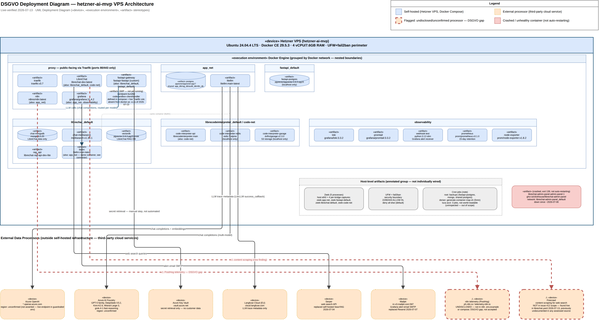

# DSGVO Deployment Diagram — hetzner-ai-mvp VPS

Companion to `dsgvo-deployment-diagram.drawio` (editable source), `dsgvo-deployment-diagram.drawio.png` (embedded XML), and `dsgvo-deployment-diagram.svg`.
Built for issue #12: a single artifact for an upcoming DSGVO assessment showing which services run on our own infrastructure versus which hand data to a third-party processor outside our control.

This is a UML deployment diagram, not the Service Architecture Diagram (`vps-architecture.drawio`, outside this repo — see "Relationship to other diagrams" below) and not a Data Flow Diagram.
It answers one question: which self-hosted service reaches out to which external processor, and why.
It does not classify what personal data crosses each edge — that is a distinct, narrower question the project's domain vocabulary (`CONTEXT.md`) already reserves for a separate Data Flow Diagram.

## Diagram

Self-hosted infrastructure (blue, solid) is drawn as one `«device»` node for the Hetzner VPS, with `«execution environment»` Docker Engine containing six nested `«artifact»` boundaries — one per Docker network.
External processors (orange, dashed) are drawn as one `«device»` node each.
Two processors are additionally flagged in red (thicker dashed border, ⚠ prefix) because they are not accepted, reviewed processor relationships — they are open DSGVO gaps.

**litellm is drawn twice, once per network it belongs to** (`app_net` and `librechat_default`), linked by a thin dashed "same container" connector.
This is the one exception to the single-placement-plus-annotation convention used for every other multi-homed container (n8n, grafana, LibreChat, fastapi-gateway), added on request so litellm's role is visible in both network contexts rather than only in a text annotation.
A solid navy edge also shows `fastapi-gateway → litellm` ("LLM calls"), the one internal, self-hosted-to-self-hosted edge on this diagram — added on request as an exception to the "no internal request-flow" scope below, since litellm's role as the single LLM gateway is otherwise easy to miss.

## Service Inventory

### Self-hosted (Hetzner VPS, Docker Compose)

| Container | Docker network(s) | Role |
|---|---|---|
| traefik | proxy | Reverse proxy, TLS termination |
| LibreChat | proxy, librechat_default, code-net | Chat UI |
| fastapi-gateway | proxy, librechat_default, fastapi_default | Agent backend, LiteLLM proxy injection |
| n8n | proxy, app_net | Workflow automation |
| grafana | proxy, app_net, observability | Observability dashboards, alerting |
| sandpack-bundler | proxy | LibreChat code-sandbox bundler — **WIP, not yet running** (see Sources) |
| postgres | app_net | Shared Postgres: app_db / rag_db / audit_db / n8n_db |
| litellm | app_net, librechat_default | LLM gateway to Azure — drawn as two artifacts (one per network), linked by a "same container" connector; see "Internal callers" below |
| fastapi-postgres | fastapi_default | FastAPI's own DB (localhost only) |
| chat-mongodb | librechat_default | LibreChat data only |
| chat-meilisearch | librechat_default | LibreChat search |
| vectordb | librechat_default | LibreChat RAG DB |
| rag_api | librechat_default | LibreChat RAG pipeline |
| code-interpreter-api | librecodeinterpreter_default, code-net | LibreChat code interpreter |
| code-interpreter-redis | librecodeinterpreter_default | Redis for code interpreter (localhost only) |
| code-interpreter-garage | librecodeinterpreter_default | S3-compatible object storage (localhost only) |
| loki | observability | Log aggregation |
| promtail | observability | Log collector |
| webhook-test | observability | Grafana alert webhook receiver |
| prometheus | observability | Metrics (15-day retention) |
| node-exporter | observability | Host metrics exporter |
| zeek, zeek-app-net, zeek-fastapi-default, zeek-librechat-default, zeek-code-net | host network / per-bridge | Network egress monitoring — drawn as one annotated group, not individually wired |
| librechat-admin-panel-admin-panel-1 | librechat-admin-panel_default | **Crashed (exit 139) since ~2026-07-06, not auto-restarting** — drawn as a crashed artifact, not a healthy node |

**Explicitly excluded, with reason:** `quirky_lichterman`, `gracious_moser`, `nice_bouman` — three `hello-world` containers left over from Docker installation verification, exited 4 weeks ago, not part of the application stack.

### External processors (third-party, outside self-hosted infrastructure)

| Processor | Purpose | Status |
|---|---|---|
| Azure OpenAI | Chat completions + embeddings, via LiteLLM | Accepted; EU/non-EU region not asserted (live endpoint in guardrailed `.env`, not `.env.example`) |
| Azure AI Foundry | Chat completions — GPT-5 family, DeepSeek-V3.2, Kimi-K2.6, Mistral-Large-3, grok-4-1-fast-reasoning, via LiteLLM | Accepted; region not asserted |
| Azure Key Vault | Postgres/FastAPI/LiteLLM secret retrieval — no customer data | Accepted; manual step (`load-secrets.sh` / `vault.py`), not in the automated deploy path |
| Langfuse Cloud (EU) | LLM trace metadata via LiteLLM `success_callback` | Accepted |
| Serper | Web search queries, via LibreChat | Accepted; replaced self-hosted SearXNG 2026-07-04 |
| Mailjet | Grafana alert email SMTP (`in-v3.mailjet.com:587`) | Accepted; replaced Resend 2026-07-07 |
| **n8n telemetry** (`ph.n8n.io` / `telemetry.n8n.io`) | PostHog product telemetry | ⚠ **Flagged — undisclosed/unconfirmed.** Not configured or disabled anywhere in `n8n/.env.example` or `n8n/docker-compose.yml`; live-verified via Zeek. Not an accepted processor relationship. |
| **Firecrawl** | Content scraping for LibreChat web search results | ⚠ **Flagged — new finding, not in issue #12's original scope.** Found live in `librechat.yaml` (`scraperProvider: firecrawl`) during this diagram's own verification pass on 2026-07-13. Not previously documented in any of the five source docs listed below. |

## Sources

**Docs read** (all in `ki-business-stuff`, read 2026-07-13): `hetzner-ai-mvp.md`, `docs/architecture.md`, `docs/logging-assessment.md`, `docs/azure-key-vault-handoff.md`, `docs/zeek-egress-attribution-assessment.md`.

**Live commands run on 2026-07-13** (read-only, via `ssh dorian@hetzner-ai-mvp`, no `.env` files read):

- `docker ps -a` — full container inventory, cross-checked against the table above
- `docker network ls` and `docker network inspect` on every named network (`proxy`, `app_net`, `librechat_default`, `fastapi_default`, `librecodeinterpreter_default`, `observability`, `code-net`, `librechat-admin-panel_default`)
- `sudo ufw status verbose`
- `crontab -l`, `ls /etc/cron.d`, `ls /srv/cron.d`
- `git log` / `git branch -a` in `/srv` — confirmed `load-secrets.sh` and the Key Vault integration are on `main`
- Reads (config only, no secrets) of `litellm-config.yml`, `librechat.yaml`, `n8n/.env.example` + `n8n/docker-compose.yml`, `observability/.env.example` + `observability/docker-compose.yml`, `fastapi/docker-compose.yaml`, and `find /srv -iname '*.env.example'` to enumerate every example file under `/srv`
- `ls /srv/apps/sandpack/` and its `docker-compose.yml` — confirmed `sandpack-bundler` is defined with a live Traefik rule but absent from `docker ps -a`, i.e. **imminent, not confirmed live**

## Contradictions found

> _`docs/azure-key-vault-handoff.md` ("Current State" section) states the integration is "built and tested but not yet live" and that "the VPS is on `main` because test users are active," implying the Key Vault work sits unmerged on `feat/azure-key-vault`.
> Live verification (2026-07-13) contradicts this: `git log -- load-secrets.sh` on the VPS's checked-out `main` branch shows the Key Vault commits are already merged, and `hetzner-ai-mvp.md`'s own later note ("Azure Key Vault secret management merged to main... Manual step for now") agrees with the live state.
> The handoff doc is stale as of this diagram's validation date — the diagram and this table follow the live/current state (merged, manual step), not the handoff doc's "not yet live" claim._

## Relationship to other diagrams

Per this repo's domain vocabulary (`CONTEXT.md`) and ADR-0001, `vps-architecture.drawio` (in the parent `ki-business-stuff` directory) is the **Service Architecture Diagram** — topology/connectivity only, no data classification, no self-hosted/external distinction.
It was last modified 2026-06-25, predating several changes reflected in this deployment diagram (Serper, Mailjet, Zeek container attribution, the Key Vault merge, the admin-panel crash, sandpack-bundler).
It is not re-derived or corrected here — that is a separate maintenance item outside this issue's scope.

A **Data Flow Diagram** (data category per edge, per `CONTEXT.md`'s "Live Edge" definition) does not yet exist as a built artifact.
This deployment diagram is neither of those two — it is a third, DSGVO-specific artifact scoped to issue #12: the self-hosted/external processor boundary, with edges labeled by *purpose*, not by data category or general topology.

## Limitations / Out of Scope

- **No payload/content-level data flow.**
  This diagram shows *that* and *why* a self-hosted service talks to a processor, not *what* personal data crosses that edge — the same content-inspection ceiling already documented in `zeek-egress-attribution-assessment.md`.
  For data-category-level detail, see "Relationship to other diagrams" above.
- **No legal AVV/DPA determination.**
  An edge on this diagram is not a finding that a data-processing agreement exists with that processor — that is a separate legal/compliance follow-up.
- **Not automatically regenerated.**
  This is a dated, manual snapshot validated 2026-07-13.
  Re-validate before relying on it for a future assessment.
- **No full internal request-flow detail, with one exception.**
  Internal service-to-service edges are only drawn where they establish which self-hosted service is the one reaching out to a given external processor, plus the single `fastapi-gateway → litellm` edge (added on request, since litellm is drawn twice — see "Diagram" above).
  General internal topology is already covered by `docs/architecture.md`.
- **Second VPS account's cron jobs not inspected.**
  `luca`'s three cron jobs are noted as present in the "Host-level artifacts" group but were not opened — not world-readable, not this task's to open.
- **Azure region not asserted.**
  Whether Azure OpenAI / Azure AI Foundry calls land in an EU region is not confirmed — the actual resource endpoint lives in the guardrailed `.env`, not `.env.example`.

## Testing / validation checklist

Run 2026-07-13, per issue #12's Testing Decisions:

- [x] Every container in `docker ps -a` appears in the diagram as an artifact, or is explicitly and intentionally omitted with a stated reason (the three `hello-world` containers).
- [x] All 8 external processors identified (7 from the issue + 1 new finding, Firecrawl) appear as distinct nodes with at least one labeled edge each.
- [x] Self-hosted vs. external is distinguishable by color/legend alone (blue solid vs. orange dashed, with a separate red-flagged style for gaps and crashed containers).
- [x] `scripts/validate.py` structural lint: 0 errors, 0 warnings.
- [x] Vision self-check performed on the exported preview (2 rounds — fixed a header/swimlane text overlap and relocated the host-level artifacts group so it no longer sat in the path of outgoing edges).
- [x] Cross-checked against the five source docs; the one contradiction found (Key Vault handoff staleness) is stated above rather than silently resolved.
